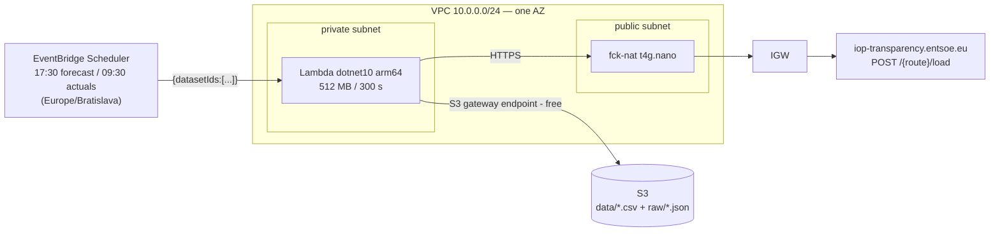

# ENTSO-E Transparency Platform Scraper

Config-driven AWS Lambda (C# / .NET 10) that scrapes generation data from the new
ENTSO-E Transparency Platform and stores it as CSV in S3. All infrastructure is
Terraform: a 1-AZ VPC with a fck-nat instance for egress, an S3 gateway endpoint,
and EventBridge Scheduler crons.

## Architecture



## How it works

The internal API follows one naming convention: the JSON data endpoint behind any
Transparency Platform UI page is that page's route path with `/load` appended — the
`generation/forecast/dayAhead` page, for example, is served by
`POST {baseUrl}/generation/forecast/dayAhead/load`. There is no authentication and no
cookies; the only required header is `Content-Type: application/json`. The request body
(`dtoIn`) is always the same three fields: `dateTimeRange` (UTC ISO-8601), `areaList`
(`"<AREA_TYPE>|<EIC>"` strings), and `timeZone`.

Every dataset's response shares one envelope: `instanceList` (one entry per area, or per
generation unit for perUnit datasets), each instance's `curveData.periodList`, each
period's `pointMap` (values indexed by step). The *meaning* of each value column is never
fixed in code — it is read from `metaData[i].code` at request time, so the scraper never
hardcodes column order, and a platform adding a column becomes a new CSV column instead of
silent misalignment.

Timestamps are derived, never assumed: `period.timeInterval.from + index × resolution`.
This is DST-proof by construction — a 23-hour spring-forward day or a 25-hour fall-back day
just produces fewer or more points, with no special-casing. Cell values are decoded per the
platform's own encodings: a plain number arrives as an invariant-culture string
(`"2665.90"`) and is copied verbatim; `{"alt":"N/A"}`, `{"alt":"-"}`, and `null` all
collapse to an empty CSV cell.

S3 keys are built from the *data date*, not the run date, so retries and manual re-runs
overwrite the same objects instead of piling up duplicates. Each dataset in a run is
isolated in its own try/catch — one dataset's failure never blocks the others — and the
orchestrator raises a single aggregate exception only after every selected dataset has been
attempted, so the invocation still registers a Lambda `Errors` metric (and Lambda's own
async-invocation retry re-runs it, up to 2 times by default) while every dataset that
succeeded has already landed in S3.

## Adding a dataset (the core requirement)

Adding a dataset is a config change, not a code change. Adding day-ahead prices, for
example, is one entry in `src/PowerexScraper/endpoints.json`:

```diff
   "datasets": [
     { "id": "generation-forecast-dayahead", "routePath": "generation/forecast/dayAhead", ... },
     { "id": "generation-actual-perunit", "routePath": "generation/actual/perUnit", ... },
     { "id": "generation-actual-perunit-cz", "routePath": "generation/actual/perUnit", ... },
+    {
+      "id": "market-prices-dayahead",
+      "routePath": "market/prices/dayAhead/PT60M",
+      "areas": ["BZN|10YSK-SEPS-----K"],
+      "timeZone": "CET",
+      "window": { "anchorTimeZone": "Europe/Bratislava", "startOffsetDays": 1, "durationDays": 1 },
+      "enrichment": null
+    }
   ]
```

and, to run it on a schedule, one entry in the `schedules` variable in
`terraform/variables.tf`:

```diff
   schedules = {
     forecast-evening = { cron = "cron(30 17 * * ? *)", dataset_ids = ["generation-forecast-dayahead"] }
     actuals-morning  = { cron = "cron(30 9 * * ? *)",  dataset_ids = ["generation-actual-perunit", "generation-actual-perunit-cz"] }
+    prices-evening   = { cron = "cron(30 17 * * ? *)", dataset_ids = ["market-prices-dayahead"] }
   }
```

No column list and no per-dataset code path is required — the response's own `metaData`
defines the CSV columns at runtime. `tests/PowerexScraper.IntegrationTests/EndToEndTests.cs`
proves exactly this with a "money test"
(`Money_test_a_never_coded_dataset_works_on_config_alone`): it wires up
`market/prices/dayAhead/PT60M` — a dataset never referenced anywhere in production code —
purely through a test-only `endpoints.json` fixture, and asserts the correct CSV
(`AREA,timestamp_utc,resolution,DAY_AHEAD_PRICE`) comes out the other end of the real
pipeline. (There is no bare `market/prices/dayAhead/load` route — data commands that offer
multiple resolutions carry the resolution as a path segment, `PT60M` here, as shown by the
platform's own command-path list.)

125 of the ~377 command paths extracted from the platform's app bundle are `{route}/load`
data commands on the default host — any of those can be added the same way.
Resolution-segment variants like `PT60M` above are common among them — grep the file for a
route's other `loadMap`/`PT15M`/`PT30M`/`PT60M` siblings before wiring one up.

## Repository layout

```
powerex-assignment/
├── src/PowerexScraper/              # Lambda handler + pipeline (Config/ Entsoe/ Flattening/ Csv/ Storage/), endpoints.json
├── src/PowerexScraper.LocalRunner/  # console app: same pipeline, filesystem output, live-API smoke runs
├── tests/PowerexScraper.Tests/            # unit tests + captured real JSON fixtures
├── tests/PowerexScraper.IntegrationTests/ # WireMock end-to-end tests, incl. the "money test"
├── terraform/                        # VPC, fck-nat, S3, IAM, Lambda, EventBridge Scheduler
└── scripts/build.sh                  # dotnet lambda package → dist/lambda.zip
```

## Prerequisites

- .NET 10 SDK
- Terraform ≥ 1.9
- AWS CLI v2, with credentials and a default region configured (deploy only)
- bash, plus `zip`/`unzip` (used by `scripts/build.sh` to package `dist/lambda.zip`)
- git

## Build & test

    dotnet test                       # unit + integration, fully offline (captured fixtures + WireMock)
    ./scripts/build.sh                # → dist/lambda.zip
    dotnet run --project src/PowerexScraper.LocalRunner -- --help   # live-API smoke runs from a laptop

## Deploy runbook

    ./scripts/build.sh
    terraform -chdir=terraform init
    terraform -chdir=terraform apply
    aws lambda invoke --function-name $(terraform -chdir=terraform output -raw function_name) \
      --cli-binary-format raw-in-base64-out --payload '{}' /tmp/scrape-out.json
    aws s3 ls s3://$(terraform -chdir=terraform output -raw bucket_name)/ --recursive
    terraform -chdir=terraform destroy

`terraform/.terraform.lock.hcl` is committed and pins the exact provider versions `init`
resolves — the deploy above reproduces the same provider builds every time instead of
silently picking up a newer one.

`terraform destroy` can hold at the Lambda ENI (Hyperplane) cleanup step for 10–20 minutes
— this is normal AWS behavior for a VPC-attached Lambda, not a hang; do not Ctrl-C. Cost
while deployed is roughly $0.01/hour, with the public IPv4 address ($0.005/h) the biggest
single line item.

## Costs

| Item | Rate | Notes |
|---|---|---|
| fck-nat `t4g.nano` instance | $0.0042/h | Single instance, one AZ |
| Public IPv4 address | $0.005/h | Auto-assigned to the NAT instance; the biggest line item |
| EBS (NAT instance root volume) | ≈ $0.001/h | |
| Lambda, S3, EventBridge Scheduler | ≈ $0 | At this invocation volume (2 runs/day) |
| **Total while deployed** | **≈ $0.01/h, ≈ $7.4/month** | A deploy → evidence → destroy session costs cents |
